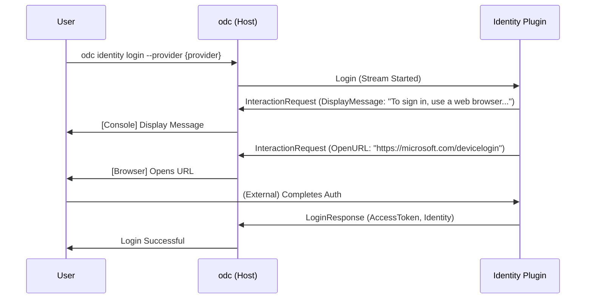

# 0010: Host-Managed Authentication UI

Date: 2026-05-09

## Status

Status: Proposed

## Context

Currently, identity plugins (e.g., Azure, Google) are responsible for their own authentication flows, including interactive actions such as opening a web browser or displaying device code prompts. 

This approach has several drawbacks:
1. **Hidden UI:** When plugin output (stderr) is redirected to log files for cleanliness, interactive prompts (like device codes) are hidden from the user.
2. **Inconsistent UX:** Each plugin might implement browser opening or message display differently, leading to a fragmented user experience.
3. **Security/Control:** The host application has no control over or visibility into the interactive actions the plugin is performing.

## Decision

We will refactor the `IdentityPlugin` gRPC interface to move the responsibility for UI interactions from the plugin to the host application. 

The `Login` method will be changed from a unary RPC to a bidirectional stream (or a plugin-to-host callback mechanism) that allows the plugin to request specific UI actions from the host.

### Revised Interaction Flow

1. The Host initiates a `Login` request.
2. The Plugin, during its authentication flow, sends an `InteractionRequest` message to the Host.
3. The Host receives the request and performs the action (e.g., opening a URL, printing a message to the console).
4. The Host sends an `InteractionResponse` (if needed) back to the Plugin.
5. Once authentication is complete, the Plugin sends the final `LoginResponse`.

### Mermaid Sequence Diagram

## Consequences

### Benefits
- **Visible Prompts:** Interactive prompts are handled by the host and remain visible to the user even if plugin logs are redirected.
- **Unified UX:** The host ensures consistent behavior for opening browsers and displaying messages across all identity providers.
- **Clean Separation:** Plugins focus on protocol-specific logic, while the host focuses on user interaction.

### Trade-offs
- **Interface Complexity:** The gRPC interface becomes more complex (streams instead of unary calls).
- **Refactoring Effort:** Existing identity plugins and the host's identity service will require significant refactoring.

## Links

- [ADR 0005: External Plugin Architecture](0005-external-plugin-architecture.md)
